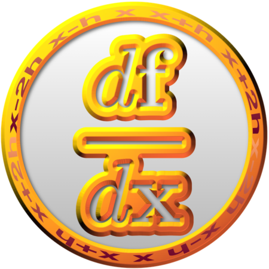

============

## Brief description

**NumDiff** provides a modern Fortran interface for computing the Jacobian (derivative) matrix of `m` nonlinear functions which depend on `n` variables. The Jacobian matrix is required for various applications, including numerical optimization. It can also be used to test the accuracy of gradients computed by other means. The library also provides for computing the sparsity of this matrix, and returning the Jacobian in sparse or dense form.

## Status


This is currently a work in progress. The goal is a comprehensive library that contains a full suite of computationally efficient implementations of algorithms for sparsity determination and numerical differentiation. This code is hosted on GitHub at: https://github.com/jacobwilliams/NumDiff

### To Do

- [x] Computing the nonlinear sparsity pattern
  - [x] Specified by the user
  - [x] Assume all elements `true`
  - [x] Three random points within variable bounds (have the option to specify separate bounds for this purpose)
- [x] Various order finite different gradient methods
  - [x] 2-point (backward 1, forward 1)
  - [x] 3-point (backward 2, central, forward 2)
  - [x] 4-point (backward 3, backward 2, forward 2, forward 3)
  - [x] 5-point (backward 4, backward 3, central, forward 3, forward 4)
  - [x] 6-point (backward 5, backward 4, backward 3, forward 3, forward 4, forward 5)
  - [x] 7-point (backward 6, backward 5, backward 4, central, forward 4, forward 5, forward 6)
  - [x] 8-point (backward 7, backward 6, backward 5, backward 4, forward 4, forward 5, forward 6, forward 7)
  - [x] 9-point (backward 8, backward 7, backward 6, backward 5, central, forward 5, forward 6, forward 7, forward 8)
  - [x] 11-point (central)
  - [x] 13-point (central)
  - [x] 15-point (central)
  - [x] 17-point (central)
- [x] Perturbations should respect variable bounds
- [x] Neville's process
- [x] Ability to use different methods for different columns
- [x] Jacobian partitioning to compute multiple columns at the same time
- [ ] Estimate the optimal perturbation step size
- [ ] Computing the linear sparsity pattern (constant elements of Jacobian)
- [ ] Add other gradient methods?
- [ ] Also compute Hessian matrix?
- [ ] OpenMP or Coarrays for parallelization
- [ ] Testing for computational efficiency
- [ ] General code cleanup

## Building NumDiff

### FPM

A `fmp.toml` file is provided for compiling roots-fortran with the [Fortran Package Manager](https://github.com/fortran-lang/fpm). For example, to build:

```
  fpm build --profile release
```

And to run the unit tests:

```
  fpm test
```

### FoBiS

A [FoBiS](https://github.com/szaghi/FoBiS) configuration file (`numdiff.fobis`) is also provided that can also build the library and examples. Use the `mode` flag to indicate what to build. For example:

  * To build all the examples using gfortran: `FoBiS.py build -f numdiff.fobis -mode tests-gnu`
  * To build all the examples using ifort: `FoBiS.py build -f numdiff.fobis -mode tests-intel`
  * To build a static library using gfortran: `FoBiS.py build -f numdiff.fobis -mode static-gnu`
  * To build a static library using ifort: `FoBiS.py build -f numdiff.fobis -mode static-intel`

  The full set of modes are: `static-gnu`, `static-gnu-debug`, `static-intel`, `static-intel-debug`, `shared-gnu`, `shared-gnu-debug`, `shared-intel`, `shared-intel-debug`, `tests-gnu`, `tests-gnu-debug`, `tests-intel`, `tests-intel-debug`

  To generate the documentation using [ford](https://github.com/Fortran-FOSS-Programmers/ford), run: ```FoBis.py rule --execute makedoc -f numdiff.fobis```

  To run the test programs, run: ```FoBis.py rule --execute tests -f numdiff.fobis```

## Documentation

The latest API documentation can be found [here](http://jacobwilliams.github.io/NumDiff/). This was generated from the source code using [FORD](https://github.com/Fortran-FOSS-Programmers/ford) (note that the included `build.sh` script will also generate these files).

## License

The NumDiff source code and related files and documentation are distributed under a permissive free software [license](https://github.com/jacobwilliams/NumDiff/blob/master/LICENSE) (BSD-style).

## References

 * J. Oliver, "An algorithm for numerical differentiation of a function of one real variable", Journal of Computational and Applied Mathematics 6 (2) (1980) 145–160.  Fortran 77 code from [NIST](ftp://math.nist.gov/pub/repository/diff/src/DIFF)
 * Thomas F. Coleman, Burton S. Garbow, Jorge J. More, "Algorithm 618: FORTRAN subroutines for estimating sparse Jacobian Matrices", ACM Transactions on Mathematical Software (TOMS), Volume 10 Issue 3, Sept. 1984, Pages 346-347
